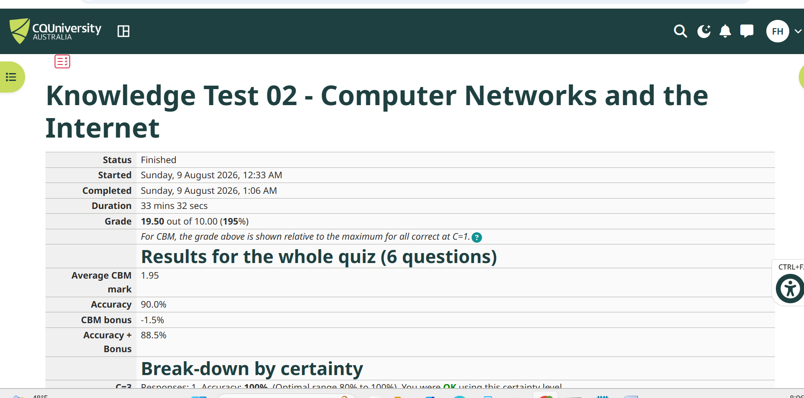
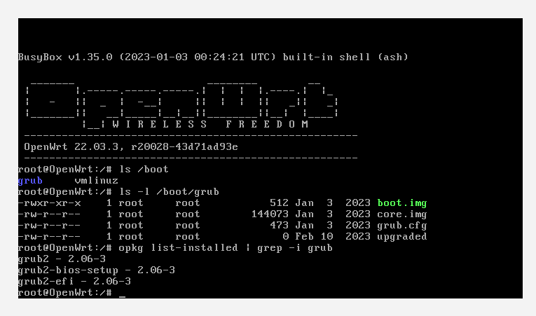
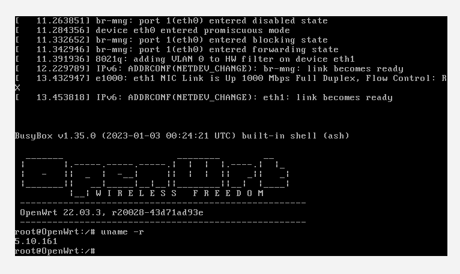
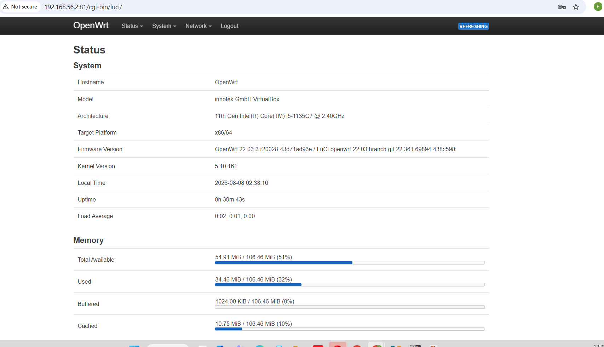
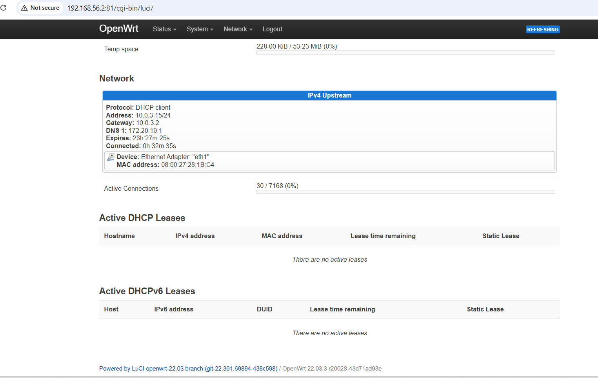

## Task 1 - Knowledge Test

I completed the Week 1 Computer Systems and Applications Knowledge Test.



# Week 2 - Computer Systems and Applications

## Task 2 - Computer Information

### CPU

- CPU: 11th Gen Intel(R) Core(TM) i5-1135G7 @ 2.40GHz
- Maximum Clock Speed: 2419 MHz


### RAM

- Total RAM: 8,317,952,000 Bytes
- Total RAM: 7.93 GB


### Disk

- Total Disk Size: 858.85 GB


### Operating System

- OS Name: Microsoft Windows 11 Home Single Language
- OS Version: 10.0.26200 (Build 26200)


## Task 3 - Deploy Linux Web Server in VirtualBox

### Boot Manager

- **Name:** GRUB 2
- **Version:** 2.06-3

I found the boot manager information by checking the installed GRUB packages in OpenWRT. I used the following command:

```bash
opkg list-installed | grep -i grub
```

The command showed the following installed GRUB packages:

- grub2 - 2.06-3
- grub2-bios-setup - 2.06-3
- grub2-efi - 2.06-3

This shows that GRUB 2 version 2.06-3 is installed.



---

### Linux Kernel

- **Name:** Linux Kernel
- **Version:** 5.10.161

I found the Linux kernel version by using the following command in the OpenWRT terminal:

```bash
uname -r
```

The command returned:

```text
5.10.161
```

Therefore, the Linux kernel version running on my OpenWRT system is 5.10.161.



---

## My Description of VirtualBox

VirtualBox is a virtualization program that allows a computer to run virtual machines. A virtual machine operates similarly to a standalone computer and can have its own operating system. VirtualBox allows you to learn, test, and run several operating systems without having to physically install them on your computer.

---

## My Description of OpenWRT

OpenWRT is an operating system based on Linux that was developed mainly for networking devices such as routers. It provides tools and capabilities for managing connections and network configurations. Because OpenWRT may be used as a virtual computer, it is useful for learning about networking and network administration.

---

## AI Generated Description

### AI Prompt

Write a succinct description of VirtualBox and OpenWRT for a first-year IT student. Describe each one's goal in simple terms.

### AI Description of VirtualBox

A virtualization tool called VirtualBox lets users create and run virtual machines on a computer. Because each virtual machine may run its own operating system, VirtualBox is useful for researching, testing, and using multiple operating systems.

### AI Description of OpenWRT

OpenWRT is an open-source Linux operating system designed mainly for routers and other networking devices. Its advanced networking features allow users to set up and control network connections.

---

## Comparison Between My Description and AI Description

Both my and the AI-generated descriptions explain the main objective of VirtualBox and OpenWRT, which is why they are the same. My VirtualBox description focuses on virtual machines and demonstrates their ability to run several operating systems. The primary focus of my description is the use of OpenWRT as a networking operating system based on Linux.

Although the AI explanations provide comparable information, they differ slightly in terminology and are a little more extensive. Generally speaking, both answers give a clear overview of OpenWRT and VirtualBox's main purpose.


## Task 4 - Browse to OpenWRT Websites

### Example Web Site

I accessed the example web site using the web browser on my Windows host operating system. The example web page loaded successfully.


---

### OpenWRT Management Interface

I accessed the OpenWRT management interface from my Windows web browser using the OpenWRT guest's management IP address.

The management interface was accessed using:

`http://192.168.56.2:81/cgi-bin/luci`

After logging in with the OpenWRT root account, I was able to view the OpenWRT status and system information.



---

### OpenWRT System Information

The following information was recorded from the OpenWRT management interface:

- **CPU:** 11th Gen Intel(R) Core(TM) i5-1135G7 @ 2.40GHz
- **Architecture:** x86/64
- **RAM:** 106.46 MiB (approximately 111,631,401 Bytes)
- **Disk Size:** 102.33 MiB (approximately 107,300,782 Bytes)
- **Operating System:** OpenWrt 22.03.3
- **Kernel Version:** 5.10.161

The OpenWRT management interface showed 106.46 MiB as the total available memory. The storage section showed a total disk space of 102.33 MiB.

---

### OpenWRT Network Information

The network information was obtained from the Network section at the bottom of the OpenWRT management interface.

- **Protocol:** DHCP client
- **Address:** 10.0.3.15/24
- **Gateway:** 10.0.3.2
- **DNS 1:** 172.20.10.1
- **DNS 2:** Not displayed
- **Device:** Ethernet Adapter: eth1
- **MAC Address:** 08:00:27:28:1B:C4




## Task 5 - Complete Week 1 Tutorial

I reviewed my Week 1 journal to be sure I had completed every task. I also confirmed that my Week 1 diary post and Knowledge Test screenshot were included in my GitHub repository.

I've finished the lesson exercises for Weeks 1 and 2.
