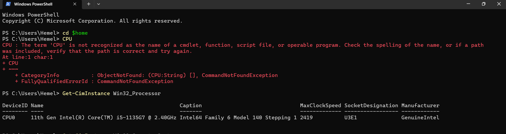
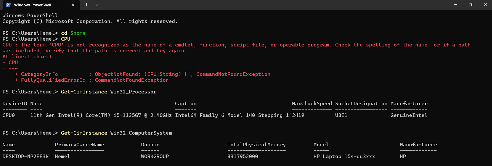
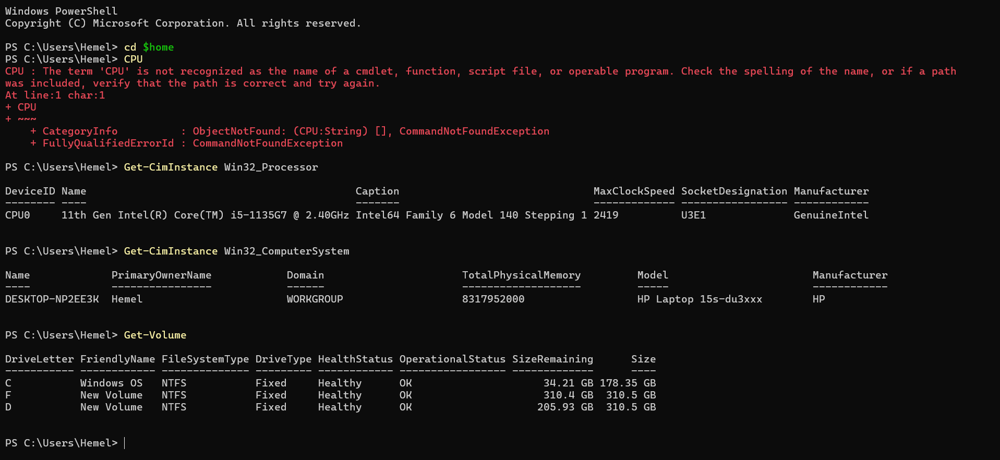
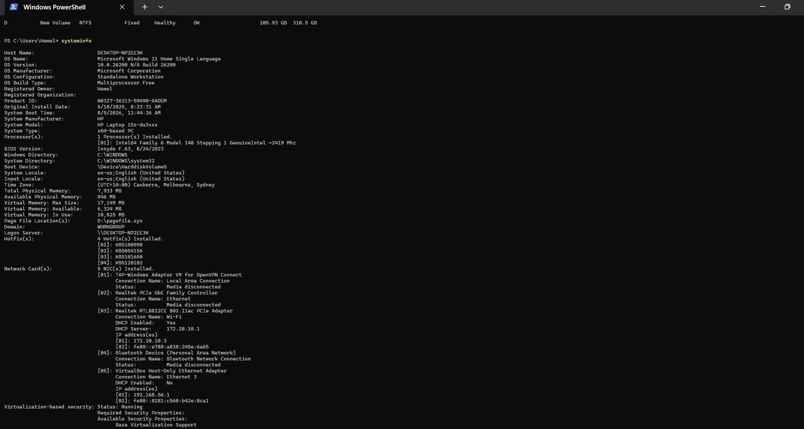

# Week 2 - Computer Systems and Applications

## Task 2 - Computer Information

### CPU

- CPU: 11th Gen Intel(R) Core(TM) i5-1135G7 @ 2.40GHz
- Maximum Clock Speed: 2419 MHz

### RAM

- Total RAM: 8,317,952,000 Bytes
- Total RAM: 7.93 GB

### Disk

- Total Disk Size: 858.85 GB

### Operating System

- OS Name: Microsoft Windows 11 Home Single Language
- OS Version: 10.0.26200 (Build 26200)

