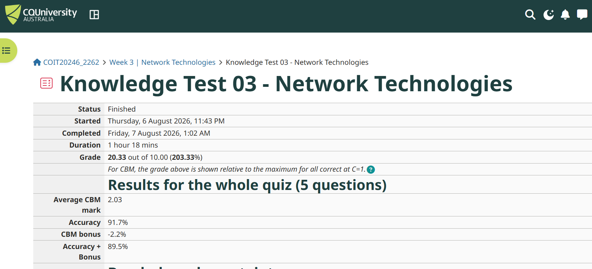
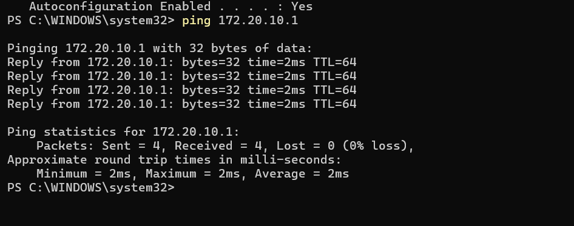
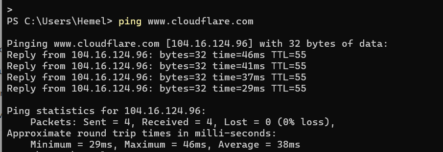
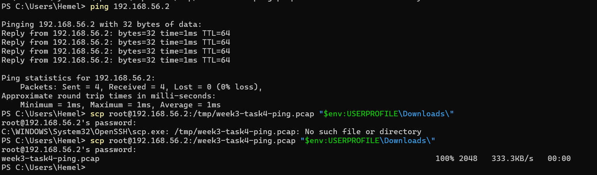
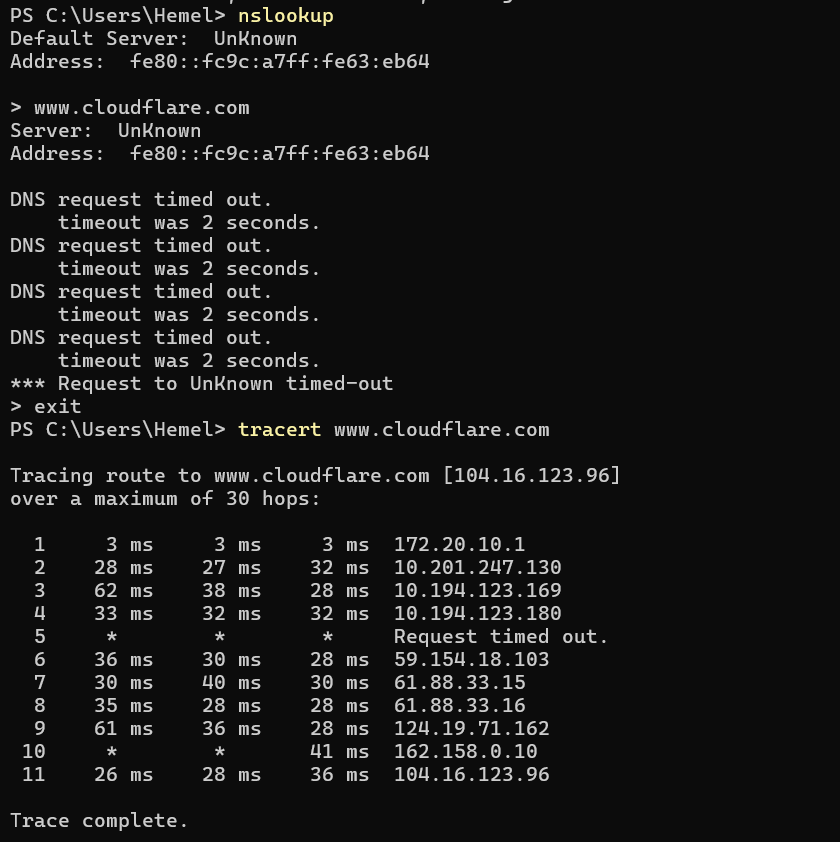
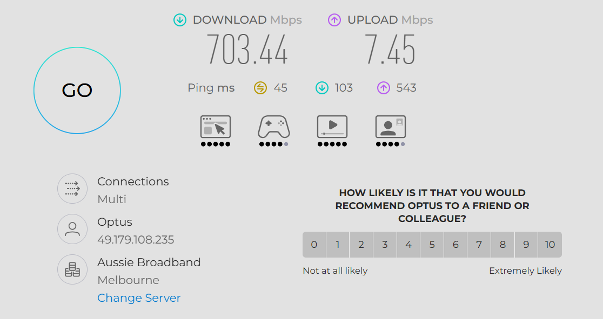
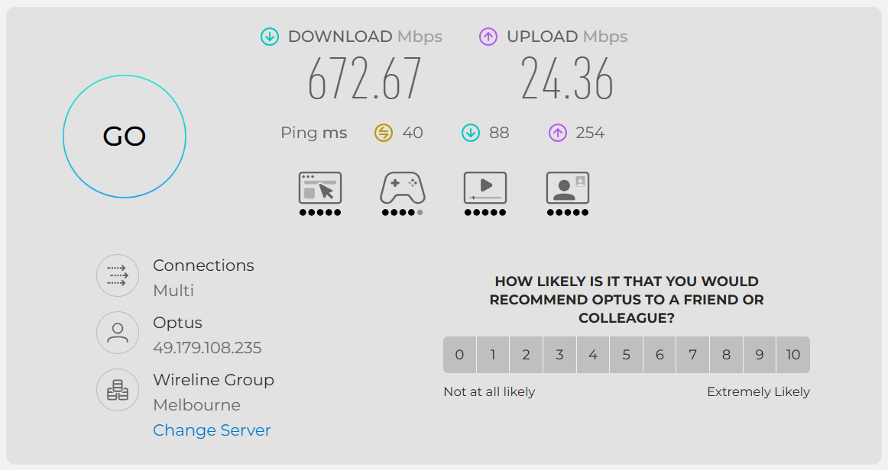

## Task 1 - complete the quize




## Task 2 - View Your Addresses

### Command

```powershell
ipconfig /all
```

### Screenshot


### Address Information

| Address | Value | Description |
|---------|-------|-------------|
| Host Name | DESKTOP-KTLTPI7 | The name of my computer on the network. |
| IPv4 Address | 172.20.10.9 | Identifies my computer on the local network. |
| Subnet Mask | 255.255.255.240 | Separates the network portion and host portion of the IP address. |
| Default Gateway | 172.20.10.1 | The router used to access other networks and the Internet. |
| Physical (MAC) Address | 70-CD-0D-43-2D-8F | A unique hardware address assigned to my Wi-Fi adapter. |
| DNS Server | 172.20.10.1 | Translates domain names into IP addresses. |

## Task 3 - Ping Your Local Router

### Command

```powershell
ping 172.20.10.1
```

### Screenshot



### Ping Results

| Item | Value |
|------|-------|
| Default Gateway | 172.20.10.1 |
| Packets Sent | 4 |
| Packets Received | 4 |
| Packets Lost | 0 (0% loss) |
| Minimum Delay | 2 ms |
| Maximum Delay | 2 ms |
| Average Delay | 2 ms |

### How I Found the Delay

I used the ping 172.20.10.1 command in PowerShell. The minimum, maximum and average round-trip times were displayed in the "Approximate round trip times in milli-seconds" section of the output.

### Discussion

The ping results show a stable connection between my computer and the local router. The minimum, maximum and average delay were all 2 ms, indicating a fast and consistent local network connection.

Network delay can change over time because of:
- Wi-Fi signal strength
- Network congestion caused by multiple devices
- Background downloads or updates
- Router workload
- Temporary wireless interference

In this test, there was 0% packet loss, which indicates that the connection to the router was reliable.


## Task 4 - Ping Your OpenWRT Linux Server

### Commands Used

```bash
ip link
ip addr
tcpdump -i br-mng -w /tmp/week3-task4-ping.pcap
```

```powershell
ping 192.168.56.2
```

### OpenWRT Server Addresses

| Address | Value | Description |
|---------|-------|-------------|
| Interface | br-mng | Management network interface |
| IPv4 Address | 192.168.56.2 | The management IP address of the OpenWRT server |
| MAC Address | 08:00:27:51:DA:12 | The hardware (MAC) address of the br-mng interface |

### Packet Capture

I started packet capture on the OpenWRT server using `tcpdump` on the `br-mng` interface. Then I pinged the server from my Windows computer using `ping 192.168.56.2`. After the ping completed, I stopped the packet capture by pressing **Ctrl + C**.

The packet capture file was saved as:

`week3-task4-ping.pcap`

The `.pcap` file has been uploaded to my GitHub journal repository.


## Task 5 - Academic Integrity Policy

### Student Academic Integrity Policy and Procedure

I reviewed the CQUniversity Student Academic Integrity Policy and Procedure. The policy explains that academic integrity means acting with honesty, trust, fairness, respect and responsibility in learning, teaching and research.

### Five Levels of Academic Integrity Breaches

1. **Level 1 - Inappropriate Academic Conduct**
   - This is the lowest level of academic integrity breach.

2. **Level 2 - Minor Academic Misconduct**
   - This is a minor form of academic misconduct.

3. **Level 3 - Moderate Academic Misconduct**
   - This is a moderate level of academic misconduct.

4. **Level 4 - Substantial Academic Misconduct**
   - This is a substantial level of academic misconduct.
   - It can include plagiarism, self-plagiarism, collusion, cheating and contract cheating.

5. **Level 5 - Serious Academic Misconduct**
   - This is the most serious level of academic misconduct.
   - It can include plagiarism, self-plagiarism, collusion, cheating and contract cheating.

### Policy Document

The Student Academic Integrity Policy and Procedure PDF has been uploaded to my GitHub journal repository.

## Task 7 - Find Addresses of a Website

### Website Selected

I selected the website **www.cloudflare.com**.

### 1. Ping Test

I used the following command to find the IP address and test connectivity to the website:

```powershell
ping www.cloudflare.com
```

The website resolved to the IPv4 address **104.16.124.96**.

- Packets sent: 4
- Packets received: 4
- Packet loss: 0%
- Minimum delay: 29 ms
- Maximum delay: 46 ms
- Average delay: 38 ms



### 2. DNS Information

I used the `nslookup` command to investigate the DNS information for the website.

```powershell
nslookup
```

I then entered:

```text
www.cloudflare.com
```

The configured DNS server was shown as:

```text
UnKnown
fe80::fc9c:a7ff:fe63:eb64
```

However, the DNS request timed out.



### 3. Traceroute

I used the following command to investigate the network path to the website:

```powershell
tracert www.cloudflare.com
```



### Address Information

| Address / Information | Result | How I found it |
|---|---|---|
| Domain Name | www.cloudflare.com | Website selected for the test |
| IPv4 Address | 104.16.124.96 | Obtained from the `ping` command |
| DNS Server | UnKnown / fe80::fc9c:a7ff:fe63:eb64 | Displayed by `nslookup` |
| DNS Lookup | Timed out | `nslookup` did not receive a response |
| Remote MAC Address | Not obtained | The remote server's MAC address was not provided by these tests |

### Conclusion

The tests successfully identified the domain name and IPv4 address of the selected website. The ping test received four successful replies with 0% packet loss and an average delay of 38 ms. The DNS lookup timed out, so additional DNS information could not be obtained from this test.

## Task 8 - Home Internet Connection

### Internet Connection Information

I use a mobile phone hotspot to connect my computer to the Internet. The mobile network used for the hotspot is Optus 5G.

| Item | Value |
|------|-------|
| Connection Type | 5G Mobile Hotspot |
| ISP | Optus |
| Mobile Network | 5G |
| Data Rate | The actual speed varies depending on network conditions and time. |

### Speed Test 1

I performed the first speed test while connected to the Internet through my Optus 5G mobile hotspot.

| Measurement | Result |
|-------------|--------|
| Download Speed | 703.44 Mbps |
| Upload Speed | 7.45 Mbps |
| Ping | 45 ms |
| Test Server | Aussie Broadband, Melbourne |



### Speed Test 2

I performed a second speed test at 10:20 AM using the same Optus 5G mobile hotspot connection.

| Measurement | Result |
|-------------|--------|
| Download Speed | 672.67 Mbps |
| Upload Speed | 24.36 Mbps |
| Ping | 40 ms |
| Test Server | Wireline Group, Melbourne |



### Comparison of Speed Test Results

| Test | Time | Ping | Download | Upload |
|------|------|------|----------|--------|
| Test 1 | First test | 45 ms | 703.44 Mbps | 7.45 Mbps |
| Test 2 | 10:20 AM | 40 ms | 672.67 Mbps | 24.36 Mbps |

The two speed tests produced different results even though I used the same Optus 5G mobile hotspot connection. The download speed decreased from 703.44 Mbps to 672.67 Mbps, while the upload speed increased from 7.45 Mbps to 24.36 Mbps. The ping also decreased from 45 ms to 40 ms.

### Why Can the Speed Change at Different Times?

The performance of a mobile Internet connection can change over time for several reasons. One important factor is network congestion. When many people are using the same mobile network or cell tower, the available bandwidth may be shared between more users.

The strength and quality of the 5G signal can also affect performance. The distance from the mobile tower, physical obstacles, interference and the location of the phone can cause changes in network performance.

Other factors can include background Internet activity on the computer or phone, the number of devices connected to the hotspot, and temporary changes in the mobile network. The speed test server can also affect the measured result because the two tests may use different servers.

### Why Is the Speed Test Different from the Data Rate?

The speed shown by a speed test is the actual performance measured at a particular time. It can change depending on network conditions, congestion, signal quality and other factors.

The data rate of an Internet service is the rate or maximum capacity associated with the service or network connection. It should not be assumed that a single speed-test result is the same as the advertised or maximum data rate of the service.

For my mobile hotspot connection, the speed test results show that the actual Internet performance can vary. The first test recorded a download speed of 703.44 Mbps, while the second test recorded 672.67 Mbps.

### Conclusion

My Internet connection uses an Optus 5G mobile hotspot. The two speed tests demonstrate that Internet performance can vary at different times. Although both tests used the same mobile hotspot connection, the download speed, upload speed and ping were different. This shows that the measured speed depends on current network conditions and should not be treated as a fixed value.
