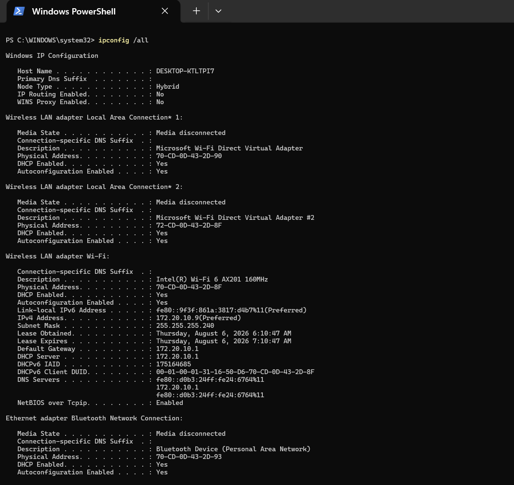

## Task 2 - View Your Addresses

### Command

```powershell
ipconfig /all
```

### Screenshot



### Address Information

| Address | Value | Description |
|---------|-------|-------------|
| Host Name | DESKTOP-KTLTPI7 | The name of my computer on the network. |
| IPv4 Address | 172.20.10.9 | Identifies my computer on the local network. |
| Subnet Mask | 255.255.255.240 | Separates the network portion and host portion of the IP address. |
| Default Gateway | 172.20.10.1 | The router used to access other networks and the Internet. |
| Physical (MAC) Address | 70-CD-0D-43-2D-8F | A unique hardware address assigned to my Wi-Fi adapter. |
| DNS Server | 172.20.10.1 | Translates domain names into IP addresses. |
