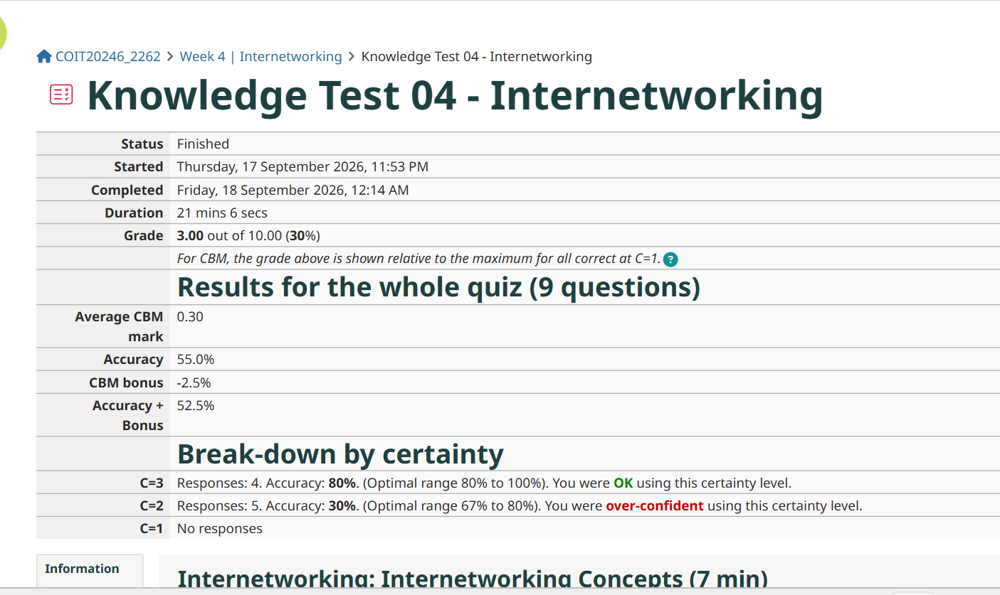
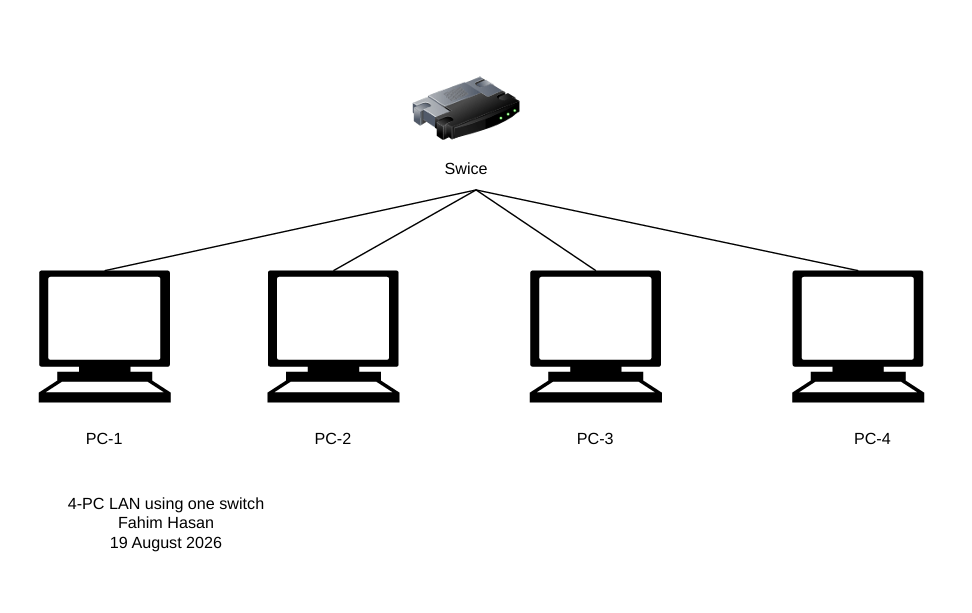
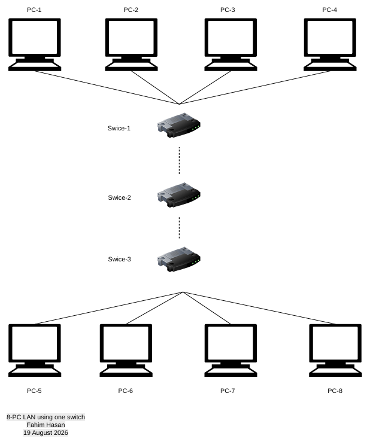
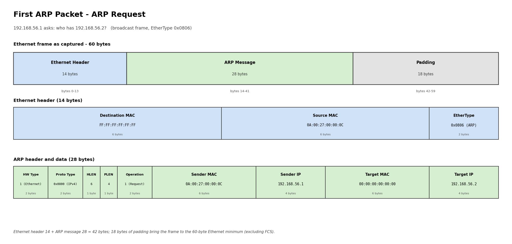
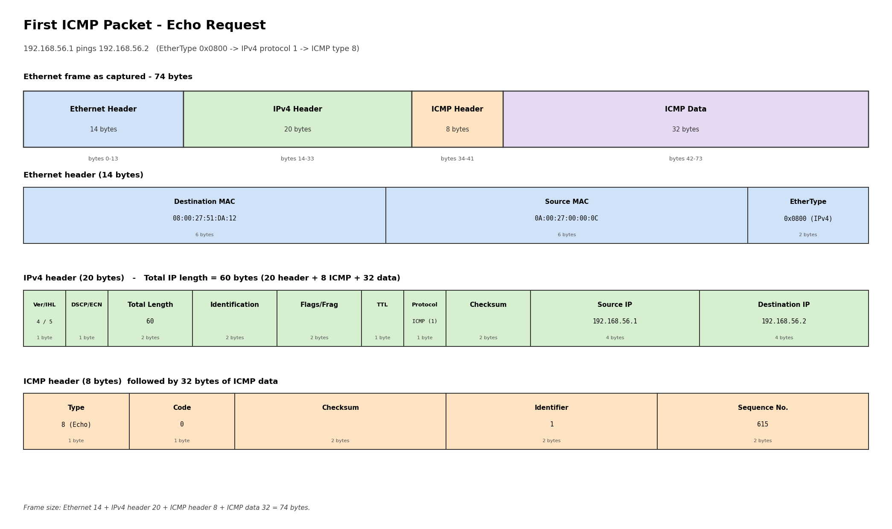

# Week 4 - Network Technologies

## Task 1 - Knowledge Test

I completed the Week 4 Knowledge Test as part of the tutorial activities.

---

## Task 2 - Project Initiation

I joined a project group through the **Group Formation - Project** section on Moodle.

The project group was formed according to the requirements provided for the **COIT20246 Networking and Cyber Security** course.

---

# Task 3 - Draw Network Diagrams

## Task 3(a) - Switched LAN with One Switch

For this task, I created a switched Local Area Network (LAN) using diagrams.net (draw.io).

The network consists of one switch and four PCs. Each PC is connected directly to the switch, forming a star topology.

### Network Diagram

### Original Draw.io File

[Open the original draw.io file](images/week4-task3-lana.drawio)

---

## Task 3(b) - Switched LAN with Three Switches

For this task, I created a switched LAN containing eight PCs and three switches.

Four PCs are connected to the first switch, and another four PCs are connected to the second switch. The first two switches are connected to a third switch, forming a hierarchical star topology.

### Network Diagram

### Original Draw.io File

[Open the original draw.io file](images/week4-task3-lanb.drawio)

---

# Task 4 - Analyse Ping Packet Capture

For this task, I analysed a previously captured ping packet file using Wireshark.

The packet capture was used to understand how the ping command operates from a networking and protocol perspective. I examined ARP and ICMP packets and investigated how information is encapsulated across different network layers.

---

## Task 4(a) - Inspect Packets in Wireshark

I opened the ping packet capture file in Wireshark and inspected the packets.

The capture contains both **ARP** and **ICMP** packets. The ARP packets are used to resolve the MAC address associated with an IP address, while the ICMP packets are used by the ping command to test connectivity between two devices.

The first packets show the ARP address-resolution process, followed by ICMP Echo Request and Echo Reply packets used for connectivity testing.

### Wireshark Packet Capture

---

## Task 4(b) - Network Diagram

The network diagram represents the two devices involved in the ping communication.

The packet capture identifies the following IP and MAC addresses:

- **Device 1**
  - IP Address: `192.168.56.1`
  - MAC Address: `0A:00:27:00:00:0C`

- **Device 2**
  - IP Address: `192.168.56.2`
  - MAC Address: `08:00:27:51:DA:12`

The communication between the devices includes ARP address resolution followed by ICMP Echo Request and Echo Reply messages.

### Network Diagram

### Original Draw.io File

[Open the original draw.io file](images/week4-task4-ping.drawio)

---

## Task 4(c) - Purpose of ARP Packets

ARP stands for **Address Resolution Protocol**. It is used to determine the MAC address associated with an IPv4 address on a local network.

In the packet capture, **192.168.56.1** sends an ARP Request to determine the MAC address of the device using IP address **192.168.56.2**.

The ARP Request is sent as a broadcast because the source device does not initially know the destination MAC address.

The device with IP address **192.168.56.2** responds with an ARP Reply containing its MAC address, **08:00:27:51:DA:12**.

This allows the source device to communicate with the destination device using Ethernet frames.

### ARP Communication

- **ARP Request sender IP:** `192.168.56.1`
- **ARP Request sender MAC:** `0A:00:27:00:00:0C`
- **Requested IP address:** `192.168.56.2`
- **ARP Request destination MAC:** `FF:FF:FF:FF:FF:FF`
- **ARP Reply sender IP:** `192.168.56.2`
- **ARP Reply sender MAC:** `08:00:27:51:DA:12`

---

## Task 4(d) - First ARP Packet Diagram

I analysed the first ARP packet in Wireshark and created a packet diagram to show its encapsulation.

The first ARP packet is an **ARP Request** sent from `192.168.56.1` to determine the MAC address associated with `192.168.56.2`.

### First ARP Packet Details

**Ethernet Header**

- Destination MAC: `FF:FF:FF:FF:FF:FF`
- Source MAC: `0A:00:27:00:00:0C`
- EtherType: `ARP (0x0806)`
- Header size: `14 bytes`

**ARP Header and Data**

- Hardware Type: `Ethernet (1)`
- Protocol Type: `IPv4 (0x0800)`
- Hardware Address Length: `6`
- Protocol Address Length: `4`
- Operation: `Request (1)`
- Sender MAC Address: `0A:00:27:00:00:0C`
- Sender IP Address: `192.168.56.1`
- Target MAC Address: `00:00:00:00:00:00`
- Target IP Address: `192.168.56.2`
- ARP message size: `28 bytes`

The captured Ethernet frame has a total size of **60 bytes**.

The remaining bytes are Ethernet padding used to meet the minimum Ethernet frame size.

### First ARP Packet Diagram

### Original Draw.io File

[Open the original draw.io file](images/week4-task4-arp-packet.drawio)

---

## Task 4(e) - First Two ICMP Packets

The first two ICMP packets were examined in Wireshark.

The first packet is an **ICMP Echo Request**, which is sent by the source device to test whether the destination device is reachable.

The second packet is an **ICMP Echo Reply**, which is sent by the destination device in response to the Echo Request.

The Echo Request and Echo Reply demonstrate successful communication between the two devices.

### First ICMP Packet - Echo Request

- Protocol: `ICMP`
- ICMP Type: `8`
- Message Type: `Echo Request`
- Source IP: `192.168.56.1`
- Destination IP: `192.168.56.2`
- Source MAC: `0A:00:27:00:00:0C`
- Destination MAC: `08:00:27:51:DA:12`

### Second ICMP Packet - Echo Reply

- Protocol: `ICMP`
- ICMP Type: `0`
- Message Type: `Echo Reply`
- Source IP: `192.168.56.2`
- Destination IP: `192.168.56.1`
- Source MAC: `08:00:27:51:DA:12`
- Destination MAC: `0A:00:27:00:00:0C`

The Echo Request is used to test connectivity, while the Echo Reply confirms that the destination device received the request and was able to respond.

---

## Task 4(f) - First ICMP Packet Diagram

I created a packet diagram for the first ICMP packet.

The first ICMP packet is an **Echo Request** sent from `192.168.56.1` to `192.168.56.2`.

### First ICMP Packet Details

**Ethernet Header**

- Source MAC: `0A:00:27:00:00:0C`
- Destination MAC: `08:00:27:51:DA:12`
- EtherType: `IPv4 (0x0800)`
- Header size: `14 bytes`

**IPv4 Header**

- Source IP: `192.168.56.1`
- Destination IP: `192.168.56.2`
- Protocol: `ICMP (1)`
- Header Length: `20 bytes`
- Total IP Length: `60 bytes`

**ICMP Header**

- Type: `8`
- Code: `0`
- Message Type: `Echo Request`
- Identifier: `1`
- Sequence Number: `615`
- ICMP Data: `32 bytes`

The captured Ethernet frame has a total size of **74 bytes**.

The packet structure is therefore:

- Ethernet Header: `14 bytes`
- IPv4 Packet: `60 bytes`
- ICMP Header: `8 bytes`
- ICMP Data: `32 bytes`

### First ICMP Packet Diagram

### Original Draw.io File

[Open the original draw.io file](images/week4-task4-icmp-packet.drawio)

---

# Task 5 - View ARP Table (Optional)

This task is optional.

The ARP table can be viewed using PowerShell to identify devices that have been discovered on the local network.

After communicating with other devices, for example by using the ping command or accessing websites, the ARP table can be checked to identify the IP and MAC addresses stored by the computer.

### ARP Table Screenshot

### Reachable Devices

| Device | IP Address | MAC Address | Reason |
|---|---|---|---|
| Device 1 | `192.168.56.1` | `0A:00:27:00:00:0C` | Discovered through ARP communication |
| Device 2 | `192.168.56.2` | `08:00:27:51:DA:12` | Discovered through ARP communication |
