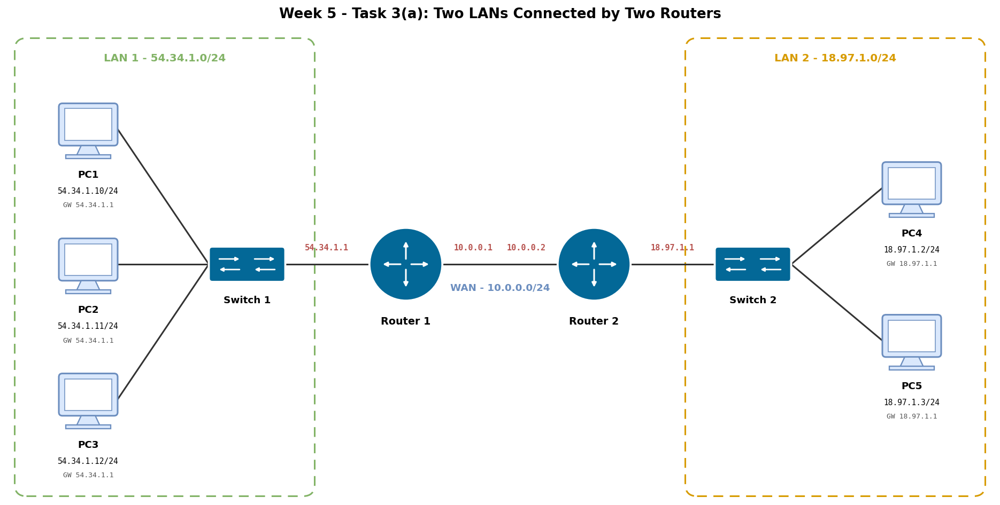

# Week 5 – IP Addressing and Routing

## Task 1 – Knowledge Test

I completed the Week 5 Knowledge Test as part of the tutorial activities.

---

## Task 2 – Viewing the IPv4 Routing Table

### Objective

To examine the IPv4 routing table of my computer and understand how it decides where to send outgoing packets.

### Method

I ran the `route print` command in Windows PowerShell and reviewed the IPv4 routing table for my primary Wi-Fi network interface.

### Evidence

.png>)

*Figure 1 – Output of `route print` in Windows PowerShell.*

### Analysis

The interface used by this computer has the IP address `172.20.10.2`. The main entries in the routing table are summarised below.

| Route Type | Destination | Netmask | Purpose |
|---|---|---|---|
| Default route | `0.0.0.0` | `0.0.0.0` | Used when no more specific route matches the destination. Traffic is forwarded to the gateway `172.20.10.1` through the interface `172.20.10.2`. |
| Local network | `172.20.10.0` | `255.255.255.240` (/28) | Directly connected subnet reachable through interface `172.20.10.2`. |
| Host route | `172.20.10.2` | `255.255.255.255` (/32) | The IP address assigned to this computer. |
| Subnet broadcast | `172.20.10.15` | `255.255.255.255` (/32) | Broadcast address of the local subnet. |
| Loopback | `127.0.0.0` | `255.0.0.0` (/8) | Communication within the local computer through the loopback address `127.0.0.1`. |
| Multicast | `224.0.0.0` | `240.0.0.0` (/4) | IPv4 multicast traffic. |
| Limited broadcast | `255.255.255.255` | `255.255.255.255` (/32) | IPv4 limited broadcast address. |

**Persistent routes:** The routing table lists `None`, which means no persistent routes have been configured manually.

### Conclusion

The routing table shows that the computer delivers traffic for `172.20.10.0/28` directly on the local network. All other destinations use the default route via the gateway `172.20.10.1`.

---

## Task 3 – Network Addressing and Routing

### Task 3(a) – Network Diagram and IP Address Table

The network consists of two LANs connected by two routers.

- **LAN 1** (`54.34.1.0/24`) contains PC1, PC2 and PC3, which connect through Switch 1 to Router 1.
- **WAN** (`10.0.0.0/24`) is the point-to-point link between Router 1 and Router 2.
- **LAN 2** (`18.97.1.0/24`) contains PC4 and PC5, which connect through Switch 2 to Router 2.

*Figure 2 – Network diagram created with diagrams.net (draw.io).*

**IP address table**

| Device | Interface | IP Address | Subnet Mask | Default Gateway |
|---|---|---|---|---|
| PC1 | Ethernet | `54.34.1.10` | `255.255.255.0` (/24) | `54.34.1.1` |
| PC2 | Ethernet | `54.34.1.11` | `255.255.255.0` (/24) | `54.34.1.1` |
| PC3 | Ethernet | `54.34.1.12` | `255.255.255.0` (/24) | `54.34.1.1` |
| Router 1 | LAN interface | `54.34.1.1` | `255.255.255.0` (/24) | N/A |
| Router 1 | WAN interface | `10.0.0.1` | `255.255.255.0` (/24) | N/A |
| Router 2 | WAN interface | `10.0.0.2` | `255.255.255.0` (/24) | N/A |
| Router 2 | LAN interface | `18.97.1.1` | `255.255.255.0` (/24) | N/A |
| PC4 | Ethernet | `18.97.1.2` | `255.255.255.0` (/24) | `18.97.1.1` |
| PC5 | Ethernet | `18.97.1.3` | `255.255.255.0` (/24) | `18.97.1.1` |

Each PC uses its local router interface as the default gateway. This is how a PC reaches any network outside its own LAN.

---

### Task 3(c) – Routing Tables

#### Router 1

| Destination Network | Subnet Mask | Next Hop | Interface | Route Type |
|---|---|---|---|---|
| `54.34.1.0/24` | `255.255.255.0` | Directly connected | LAN | Connected |
| `10.0.0.0/24` | `255.255.255.0` | Directly connected | WAN | Connected |
| `18.97.1.0/24` | `255.255.255.0` | `10.0.0.2` | WAN | Static |

Router 1 is directly connected to `54.34.1.0/24` through its LAN interface and to `10.0.0.0/24` through its WAN interface. To reach `18.97.1.0/24`, it uses a static route that forwards packets to Router 2 at the next-hop address `10.0.0.2`.

#### Router 2

| Destination Network | Subnet Mask | Next Hop | Interface | Route Type |
|---|---|---|---|---|
| `18.97.1.0/24` | `255.255.255.0` | Directly connected | LAN | Connected |
| `10.0.0.0/24` | `255.255.255.0` | Directly connected | WAN | Connected |
| `54.34.1.0/24` | `255.255.255.0` | `10.0.0.1` | WAN | Static |

Router 2 is directly connected to `18.97.1.0/24` through its LAN interface and to `10.0.0.0/24` through its WAN interface. To reach `54.34.1.0/24`, it uses a static route that forwards packets to Router 1 at the next-hop address `10.0.0.1`.

#### Example – Packet Forwarding from PC1 to PC4

1. PC1 (`54.34.1.10`) sees that PC4 (`18.97.1.2`) is outside its own subnet and sends the packet to its default gateway, `54.34.1.1` (Router 1).
2. Router 1 matches the static route for `18.97.1.0/24` and forwards the packet to the next hop `10.0.0.2` (Router 2).
3. Router 2 finds that `18.97.1.0/24` is directly connected and delivers the packet to PC4 through its LAN interface.

The reply from PC4 travels back along the reverse path using Router 2's static route to `54.34.1.0/24`.

---

## Summary

In this week's tasks I:

- examined the routing table of my own computer and explained each type of route,
- designed an IP addressing scheme for a network with two LANs and two routers,
- created the network diagram, and
- defined the routing tables that let devices in both LANs communicate.
