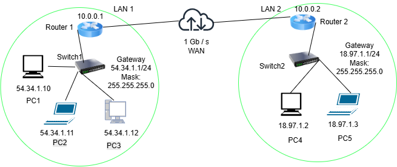

## Task 1 - Complete the Knowledge Test

I completed the Week 05 Knowledge Test.

## Task 2
.png)

### Task 2 — Viewing Routing Table

I used the Windows PowerShell `route print` command to view the IPv4 routing table for my primary Wi-Fi network interface. The routing table shows how my computer determines where to send IPv4 packets.

**Default Route:**

`0.0.0.0 / 0.0.0.0` uses gateway `172.20.10.1` through interface `172.20.10.2`. This is the default route and is used when no more specific route matches the destination.

**Local Network:**

`172.20.10.0` with netmask `255.255.255.240` is directly connected through interface `172.20.10.2`.

**Host Route:**

`172.20.10.2 / 255.255.255.255` represents the IP address assigned to my computer.

**Broadcast Route:**

`172.20.10.15 / 255.255.255.255` represents the broadcast address for the local subnet.

**Loopback Routes:**

The `127.0.0.0/8` routes are used for communication within the local computer through the loopback interface `127.0.0.1`.

**Multicast Routes:**

The `224.0.0.0/4` routes are used for IPv4 multicast traffic.

**Limited Broadcast:**

`255.255.255.255/32` represents the IPv4 limited broadcast address.

**Persistent Routes:**

The routing table shows `None`, meaning there are no manually configured persistent routes.

## Task 3(a) — IP Address Table

| Device | Interface | IP Address | Subnet Mask | Default Gateway |
|---|---|---|---|---|
| PC1 | Ethernet | 54.34.1.10 | 255.255.255.0 (/24) | 54.34.1.1 |
| PC2 | Ethernet | 54.34.1.11 | 255.255.255.0 (/24) | 54.34.1.1 |
| PC3 | Ethernet | 54.34.1.12 | 255.255.255.0 (/24) | 54.34.1.1 |
| Router 1 | LAN Interface | 54.34.1.1 | 255.255.255.0 (/24) | N/A |
| Router 1 | WAN Interface | 10.0.0.1 | 255.255.255.0 (/24) | N/A |
| Router 2 | WAN Interface | 10.0.0.2 | 255.255.255.0 (/24) | N/A |
| Router 2 | LAN Interface | 18.97.1.1 | 255.255.255.0 (/24) | N/A |
| PC4 | Ethernet | 18.97.1.2 | 255.255.255.0 (/24) | 18.97.1.1 |
| PC5 | Ethernet | 18.97.1.3 | 255.255.255.0 (/24) | 18.97.1.1 |

## 3(c) Routing Tables

### Router 1

| Destination Network | Subnet Mask | Next Hop | Interface | Route Type |
|---|---|---|---|---|
| 54.34.1.0/24 | 255.255.255.0 | Directly Connected | LAN | Connected |
| 10.0.0.0/24 | 255.255.255.0 | Directly Connected | WAN | Connected |
| 18.97.1.0/24 | 255.255.255.0 | 10.0.0.2 | WAN | Static |

**Explanation:**

Router 1 is directly connected to the `54.34.1.0/24` LAN through its LAN interface and to the `10.0.0.0/24` WAN network through its WAN interface.

To reach the `18.97.1.0/24` network, Router 1 forwards packets to Router 2 using the next-hop IP address `10.0.0.2`.

---

### Router 2

| Destination Network | Subnet Mask | Next Hop | Interface | Route Type |
|---|---|---|---|---|
| 18.97.1.0/24 | 255.255.255.0 | Directly Connected | LAN | Connected |
| 10.0.0.0/24 | 255.255.255.0 | Directly Connected | WAN | Connected |
| 54.34.1.0/24 | 255.255.255.0 | 10.0.0.1 | WAN | Static |

**Explanation:**

Router 2 is directly connected to the `18.97.1.0/24` LAN through its LAN interface and to the `10.0.0.0/24` WAN network through its WAN interface.

To reach the `54.34.1.0/24` network, Router 2 forwards packets to Router 1 using the next-hop IP address `10.0.0.1`.
