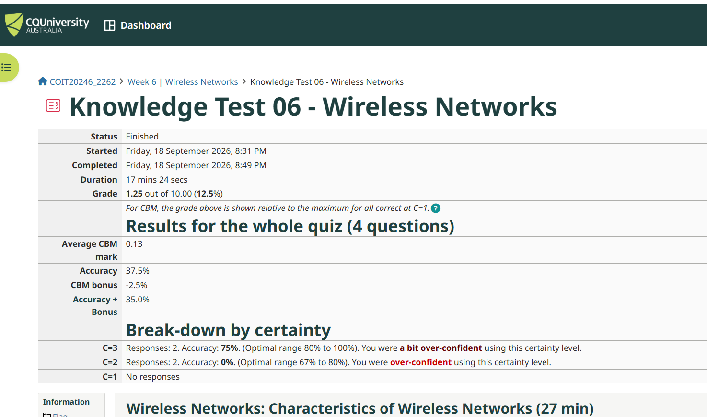
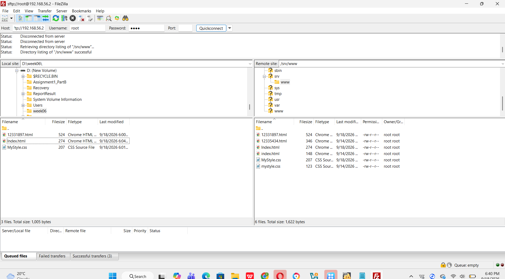
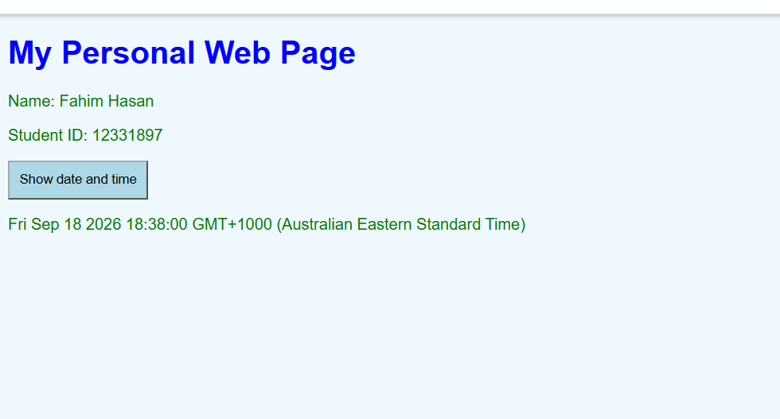
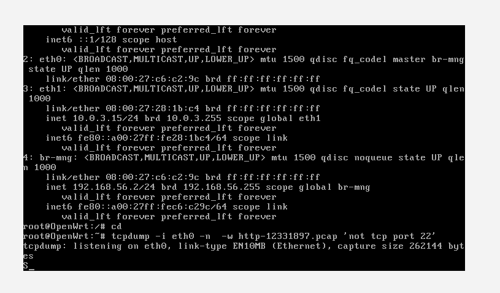
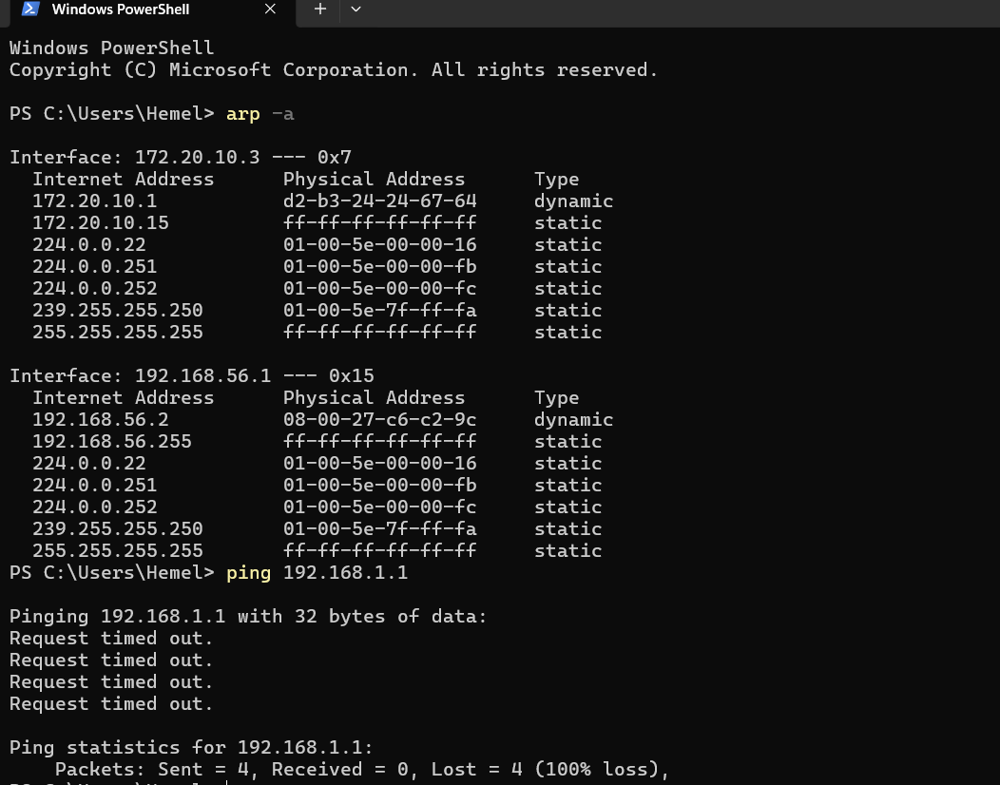
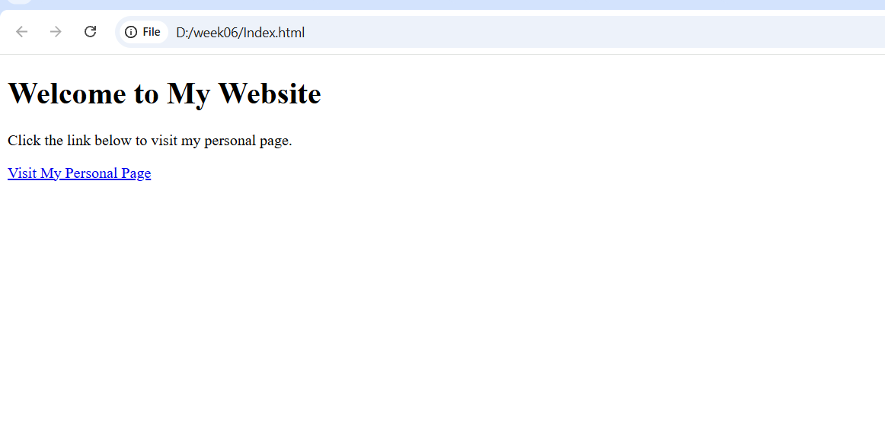
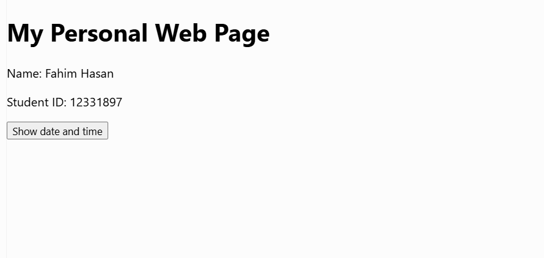
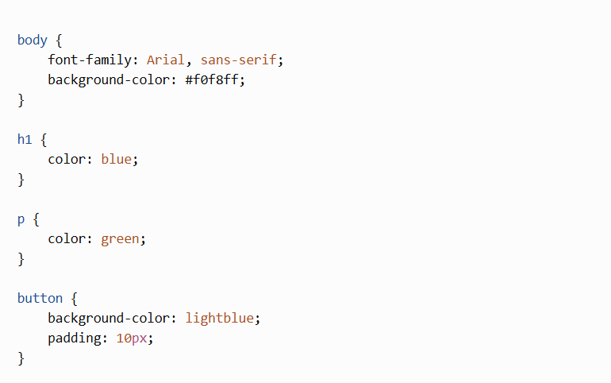
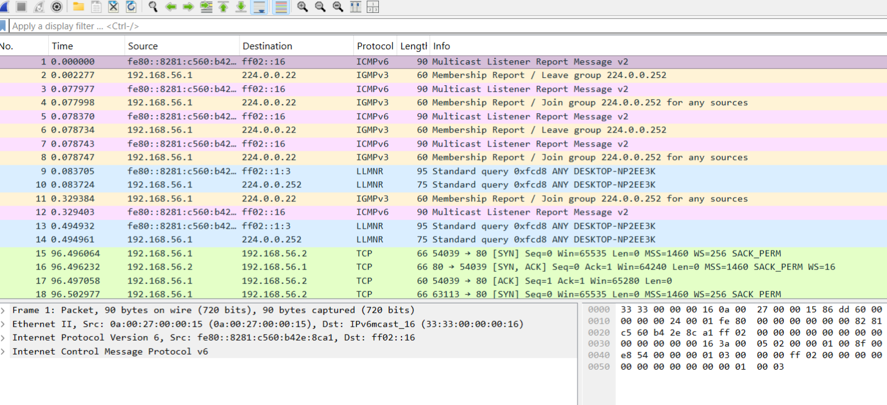
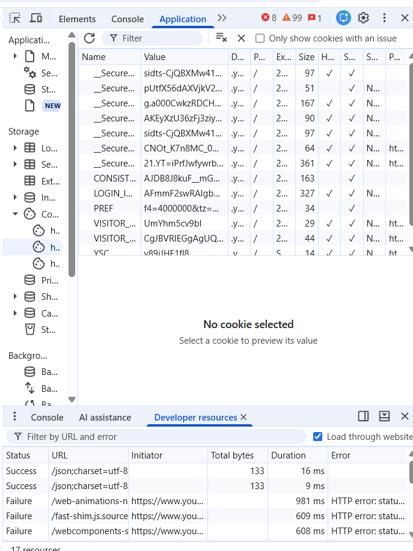

# Week 6 – Internet Applications

## Task 1 – Knowledge Test

Completed the Week 6 Knowledge Test covering the concepts discussed in the tutorial.

---

## Task 2 – Create Web Pages in OpenWRT

Created and edited the web pages on the OpenWRT server.

### Files Created

- `index.html`
- `12331897.html`
- `mystyle.css`

The webpage includes my name, student ID, a date and time button, and an external CSS file.

### Web Page Files

- `index.html`
- `12331897.html`
- `mystyle.css`

### FileZilla

The following screenshot shows the files being uploaded to the OpenWRT web server using FileZilla.

### Personal Web Page

The following screenshot shows my personal webpage.

The webpage contains:

- **Name:** Fahim Hasan
- **Student ID:** 12331897
- **Show date and time** button

When the button is clicked, the current date and time is displayed on the webpage.

The webpage uses JavaScript to display the current date and time and an external CSS file for styling.

---

## Task 3 – Capture HTTP Packets

Captured network traffic using `tcpdump` on the OpenWRT server while accessing the webpages.

The packet capture was saved as:

`http-12335434.pcap`

A Windows ARP table was also checked to identify reachable devices.

### Ping

---

# Task 4 – Analyse HTTP Packet Capture

## Task 4(a) – HTTP Request and Response

### Packet 20 – Request for the HTML page

The browser sent an HTTP GET request for `/12335434.html`. This request was triggered when the user clicked the link to the newly created webpage. The server responded in Packet 25 with `HTTP/1.1 200 OK` and returned the HTML page.

### Packet 26 – Request for the CSS file

After loading the HTML page, the browser sent a GET request for `/mystyle.css` to load the external CSS stylesheet. The server responded in Packet 29 with `HTTP/1.1 200 OK` and returned the CSS file.

### HTTP Packets Identified

| Packet | Request/Response | Information |
|---|---|---|
| 20 | HTTP Request | `GET /12335434.html HTTP/1.1` |
| 25 | HTTP Response | `HTTP/1.1 200 OK (text/html)` |
| 26 | HTTP Request | `GET /mystyle.css HTTP/1.1` |
| 29 | HTTP Response | `HTTP/1.1 200 OK (text/css)` |

---

## Task 4(b) – Five Address Values

The first HTTP request was Packet 20.

1. Source IP address: `192.168.56.1`
2. Destination IP address: `192.168.56.2`
3. Transport protocol: `TCP`
4. Source port: `54039`
5. Destination port: `80`

The application protocol is HTTP.

Packet 20 requested:

`GET /12335434.html HTTP/1.1`

---

## Task 4(c) – Date and Time Button

When the "Show date and time" button was clicked, the browser did not send a new HTTP request to the web server.

The Wireshark capture shows HTTP requests for the HTML page and the CSS file, but there is no additional HTTP request generated by the two button clicks.

The date and time was displayed directly in the browser using JavaScript, so another request to the web server was not required.

---

## Task 4(d) – Packet Diagram for HTTP Request

The HTTP request for the newly created webpage was Packet 20.

### Packet Information

- Total packet size: `636 bytes`
- Ethernet II header: `14 bytes`
- IPv4 header: `20 bytes`
- TCP header: `20 bytes`
- TCP data/HTTP request: `582 bytes`

### Address Information

**Windows Browser**

- IP address: `192.168.56.1`
- MAC address: `0a:00:27:00:00:15`

**OpenWRT Web Server**

- IP address: `192.168.56.2`
- Destination MAC address: `08:00:27:c6:c2:9c`

**TCP**

- Source port: `54039`
- Destination port: `80`

**HTTP**

- Request: `GET /12335434.html HTTP/1.1`

### Packet Size Calculation

`14 bytes Ethernet + 20 bytes IPv4 + 20 bytes TCP + 582 bytes HTTP data = 636 bytes`

### Packet Flow

---

## Task 4(e) – Referrer

The Referrer value in Packet 20 was:

`http://192.168.56.2/`

The Referrer identifies the webpage that the browser was visiting before requesting `12335434.html`.

A web server can use Referrer information to understand where a request came from and how users navigate between webpages.

---

## Task 4(f) – Browser Information

The HTTP request contains the following User-Agent information:

`Mozilla/5.0 (Windows NT 10.0; Win64; x64) AppleWebKit/537.36 (KHTML, like Gecko) Chrome ...`

From the User-Agent, the server can learn information about the user's operating system and browser. The capture indicates that the browser is Google Chrome running on Windows.

The User-Agent also contains browser engine information such as `AppleWebKit/537.36`.

---

## Task 4(g) – HTTP Version and Transport Protocol

The HTTP request contains:

`GET /12335434.html HTTP/1.1`

Therefore, the HTTP version used is:

**HTTP/1.1**

The transport protocol shown in Wireshark is:

**TCP (Transmission Control Protocol)**

---

## Task 4(h) – TCP Connection Setup

The TCP connection was established using the three-way handshake.

### TCP Connection Setup

- Packet 15: `SYN`
- Packet 16: `SYN, ACK`
- Packet 17: `ACK`

Packet 15 time:

`96.496064 seconds`

The HTTP GET request in Packet 20 started at:

`96.503210 seconds`

### Calculation

`96.503210 - 96.496064 = 0.007146 seconds`

Therefore, the time between the start of the TCP connection setup and the start of the HTTP data transfer was approximately:

**0.007146 seconds = 7.146 ms ≈ 7.15 ms**

The TCP three-way handshake establishes the connection before application data is transferred.

---

## Task 4(i) – Acknowledgements

Packet 17 is an ACK packet:

`192.168.56.1 → 192.168.56.2`

It acknowledges the SYN-ACK sent by the server during the TCP three-way handshake.

A TCP acknowledgement is typically sent to confirm that data or connection information has been successfully received.

The ACK in Packet 17 completes the TCP three-way handshake and allows data transfer to begin.

---

# Task 5 – View Your Cookies

I used Chrome Developer Tools to view the cookies stored by YouTube.

The cookies contain information such as cookie names, values, domain, path, expiry time, size, and security settings such as HttpOnly, Secure and SameSite.

Cookies can be used to maintain sessions, remember user preferences, and help websites recognise returning users.

For privacy reasons, the exact cookie values have not been included.

---

# Conclusion

In Week 6, I completed practical activities involving web pages, OpenWRT, HTTP communication, TCP connections, packet capture, ARP, browser cookies, HTML, CSS and JavaScript.

The main activities completed were:

1. Completed the Week 6 Knowledge Test.
2. Created and edited web pages on OpenWRT.
3. Used HTML, CSS and JavaScript to create a personal webpage.
4. Uploaded the webpage files to the OpenWRT web server.
5. Captured HTTP packets using `tcpdump`.
6. Checked the Windows ARP table.
7. Tested network connectivity using `ping`.
8. Analysed HTTP requests and responses using Wireshark.
9. Identified source and destination IP addresses.
10. Identified TCP source and destination ports.
11. Analysed the HTTP GET request for the HTML page.
12. Analysed the HTTP request for the CSS file.
13. Examined the Referrer and User-Agent information.
14. Identified the HTTP version and TCP transport protocol.
15. Analysed the TCP three-way handshake.
16. Examined TCP acknowledgements.
17. Viewed YouTube cookies using Chrome Developer Tools.

These activities helped me understand how web pages are created and served through OpenWRT and how browsers communicate with web servers using HTTP over TCP.
