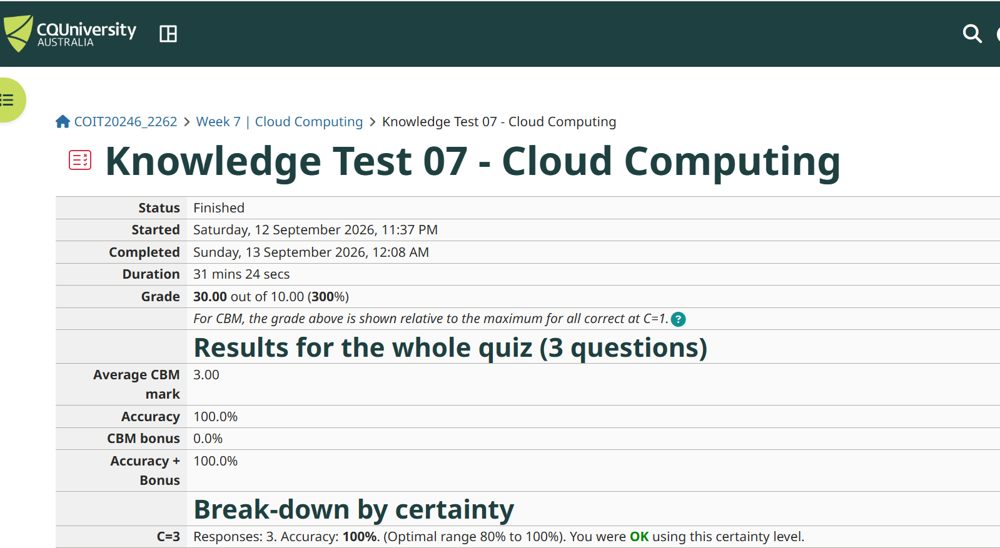
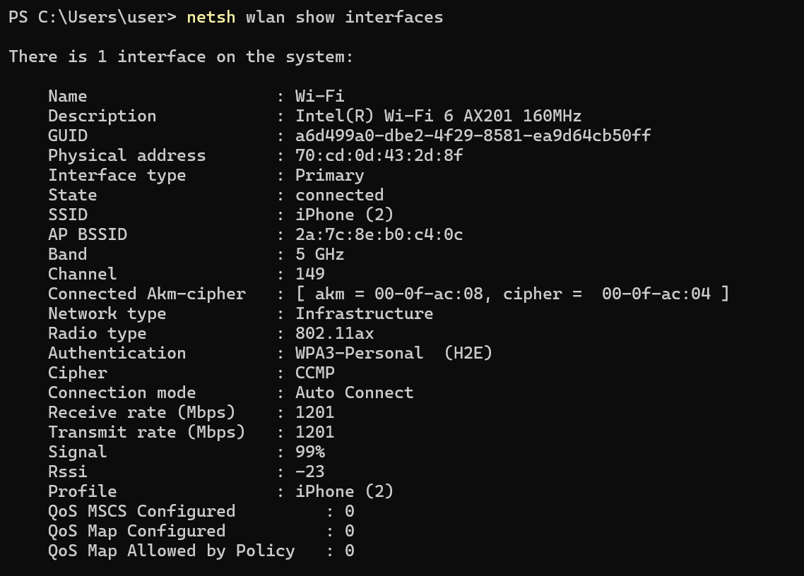
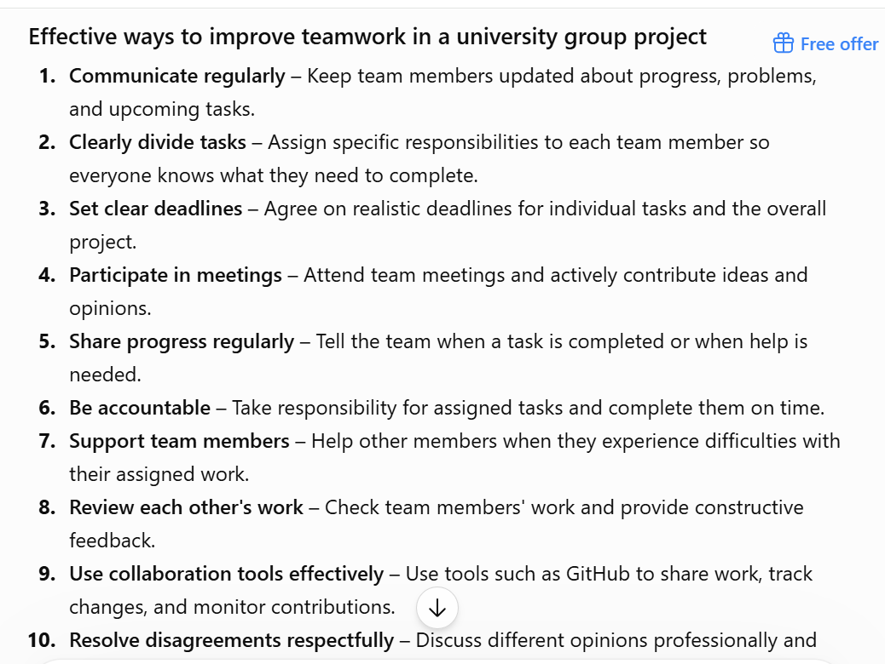

# Week 7 - Wireless Networks

## Task 1 - Knowledge Test

I completed the Week 07 Knowledge Test as part of the tutorial activities.

My Knowledge Test result is shown below.

## Task 2 - View Wi-Fi Details

I used Windows PowerShell to view the details of the Wi-Fi Access Point (AP) that my laptop was connected to.

### Wi-Fi Access Point Information

| Information | Details |
|---|---|
| SSID | iPhone (2) |
| BSSID | 2a:7c:8e:b0:c4:0c |
| Frequency Band | 5 GHz |
| Channel | 149 |
| Radio Type | 802.11ax |
| Receive Rate | 1201 Mbps |
| Transmit Rate | 1201 Mbps |
| Signal Strength | 99% |

The laptop was connected to the AP using the 5 GHz frequency band and the 802.11ax wireless standard. The connection had a signal strength of 99%, with a receive rate and transmit rate of 1201 Mbps.

### Screenshot

## Task 3 - Use Wi-Fi Access Point

I explored the settings of a wireless router using the TP-Link web emulator.

### Important Wi-Fi Settings

| Setting | What I would consider changing | Reason |
|---|---|---|
| SSID | Use a clear and unique network name | This makes the Wi-Fi network easy to identify. |
| Security | Use WPA3-Personal where supported | WPA3 provides stronger wireless security. |
| Wi-Fi Password | Use a strong and unique password | A strong password helps prevent unauthorised access. |
| Channel | Select a less congested channel | This can reduce interference from nearby Wi-Fi networks. |
| Channel Width | Use an appropriate channel width | This provides a balance between wireless performance and interference. |
| Wireless Mode | Use a modern Wi-Fi standard where supported | This can provide better performance for compatible devices. |

### Discussion

When designing a Wi-Fi network, I would consider the SSID, security, password, channel, channel width and wireless mode.

I would use a clear and unique SSID so users can easily identify the correct network. I would use WPA3-Personal where supported because it provides stronger wireless security. I would also use a strong and unique password to reduce the risk of unauthorised access.

I would select a less congested wireless channel to reduce interference from nearby networks. I would also choose an appropriate channel width because the choice of channel width can affect wireless performance and interference.

Finally, I would use a modern wireless mode where supported so compatible devices can achieve better performance.

### Screenshot

I explored the wireless router settings using the TP-Link web emulator.

### Generative AI Suggestions for Improving Teamwork

I used generative AI to identify practical ways to improve teamwork in a university group project.

The main suggestions were:

1. Communicate regularly with team members.
2. Clearly divide tasks and responsibilities.
3. Set clear deadlines.
4. Share progress regularly.
5. Participate actively in team meetings.
6. Take responsibility for assigned tasks.
7. Support team members when they experience difficulties.
8. Review and provide feedback on each other's work.
9. Use collaboration tools such as GitHub effectively.
10. Resolve disagreements respectfully and focus on the project goals.

## Task 4 - Self-Evaluation of Teamwork

### Part B - Comparison with Generative AI Suggestions

The generative AI suggestions provided several practical ways to improve teamwork, including regular communication, clear task allocation, participation in meetings, accountability, helping team members, and sharing progress.

I compared these suggestions with the way my project team currently works.

| AI Suggestion | Current Team Practice | What I Can Improve |
|---|---|---|
| Communicate regularly | Our team communicates regularly using the agreed communication method. | I will continue to communicate regularly and provide updates about my progress. |
| Clearly divide tasks | Tasks have been divided between team members. | I will make sure my assigned tasks are clearly understood and completed on time. |
| Participate in meetings | Our team participates in team meetings and discussions. | I will participate actively and share my ideas during meetings. |
| Share progress regularly | Team members discuss their progress with each other. | I will provide regular updates about my assigned work. |
| Take responsibility for assigned tasks | I am responsible for completing my assigned work. | I will complete my tasks on time and inform the team if I have any difficulties. |
| Support team members | Team members help each other when needed. | I will continue to help other members when they need support. |
| Review each other's work | Team members discuss and check project work. | I will review other team members' work when required and provide useful feedback. |
| Use collaboration tools such as GitHub | Our team uses GitHub for the project. | I will use GitHub regularly and make clear contributions to the project repository. |
| Resolve disagreements respectfully | Team members discuss project issues and work together to solve them. | I will communicate respectfully and focus on finding solutions to project problems. |

### Reflection

Overall, my current team practices are consistent with many of the suggestions provided by generative AI. Our team communicates, divides tasks, participates in meetings, uses GitHub, and supports each other.

To improve my teamwork over the next few weeks, I will communicate my progress more regularly, complete my assigned tasks on time, participate actively in discussions, and make clear contributions to the GitHub project repository.

My main contribution to the project so far has been **[write your actual contribution here]**.
