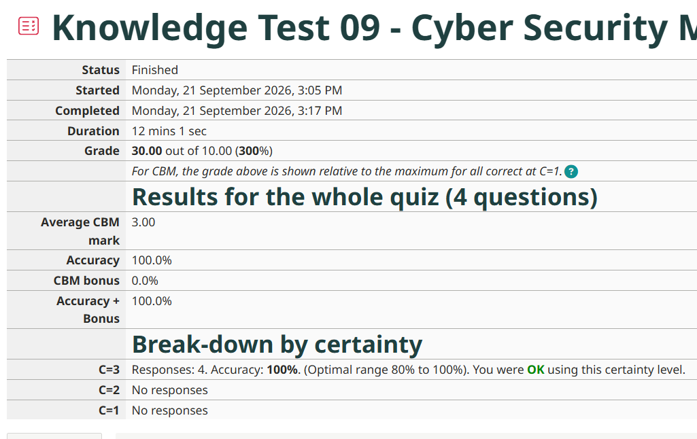

# Week 9 – Attacks and Vulnerabilities

## Task 1 – Knowledge Test

I completed the Week 9 Knowledge Test as part of the tutorial activities.

---

## Task 2 – CIA Protections

### Objective

To identify the important assets in my project network, especially data and equipment, and to use the CIA Triad (Confidentiality, Integrity, Availability) to decide what needs protecting and why.

### Project Scenario

The project network is a small business office. It has a local server that stores customer records and shared files, staff computers, a wireless network, a router/firewall with network switches, IP security cameras, and a backup system.

### Asset List

**Asset 1: Customer personal and financial records (stored on the server)**

- *Protection:* Confidentiality
  - *Reason:* Customers' names, contact details and payment information must not be visible to other customers or outsiders. A leak could cause identity theft and legal penalties under privacy laws.
- *Protection:* Integrity
  - *Reason:* Incorrect or altered records, such as changed bank details or invoice amounts, could cause financial loss and disputes.

**Asset 2: File and database server (equipment)**

- *Protection:* Availability
  - *Reason:* If the server is down, staff cannot access customer data or process orders, and the business stops operating.
- *Protection:* Integrity
  - *Reason:* If the server's software or configuration is tampered with, an attacker could hide malicious activity or corrupt every system that depends on it.

**Asset 3: Backups of business data**

- *Protection:* Availability
  - *Reason:* Backups are the recovery option after ransomware, hardware failure or accidental deletion. If they are unavailable, data loss may be permanent.
- *Protection:* Confidentiality
  - *Reason:* Backups hold a full copy of all data, so stealing a backup is as damaging as breaching the server.

**Asset 4: Router, firewall and network switches**

- *Protection:* Availability
  - *Reason:* If the core network devices fail, all internal systems and internet access are lost.
- *Protection:* Integrity
  - *Reason:* If an attacker changes firewall rules or routing settings, they could open a path into the network or redirect traffic without being noticed.

**Asset 5: Staff user accounts and passwords**

- *Protection:* Confidentiality
  - *Reason:* Stolen credentials let an attacker act as a legitimate user and bypass most other security controls.
- *Protection:* Integrity
  - *Reason:* Unauthorised changes to accounts or permissions could give an attacker administrator access.

**Asset 6: Wireless network (Wi-Fi) and its access key**

- *Protection:* Confidentiality
  - *Reason:* If the Wi-Fi key is shared with outsiders, they can connect to the internal network and capture traffic.
- *Protection:* Availability
  - *Reason:* Staff devices and wireless equipment rely on the Wi-Fi, so disruption stops work.

**Asset 7: Security cameras and their recordings**

- *Protection:* Availability
  - *Reason:* If the cameras are down, no footage will be available if a crime is committed.
- *Protection:* Integrity
  - *Reason:* Footage that has been edited or deleted cannot be trusted as evidence.
- *Protection:* Confidentiality
  - *Reason:* Recordings show staff and customers, so they must only be accessible to authorised people.

**Asset 8: Staff computers and laptops**

- *Protection:* Availability
  - *Reason:* Staff need working computers to do their jobs, and ransomware could lock them.
- *Protection:* Confidentiality
  - *Reason:* Lost or compromised devices may expose locally stored documents and saved logins.

### Summary of CIA Priorities

| Asset | Confidentiality | Integrity | Availability |
|---|:---:|:---:|:---:|
| Customer personal and financial records | ✔ | ✔ | |
| File and database server | | ✔ | ✔ |
| Backups | ✔ | | ✔ |
| Router, firewall and switches | | ✔ | ✔ |
| Staff accounts and passwords | ✔ | ✔ | |
| Wireless network and access key | ✔ | | ✔ |
| Security cameras and recordings | ✔ | ✔ | ✔ |
| Staff computers and laptops | ✔ | | ✔ |

---

## Task 3 – Threat Sources and Motivation

### Objective

To list the most likely types of adversarial threat sources (attackers) for the project network and the motivation of each.

### Threat Sources

| # | Threat Source | Motivation |
|---|---|---|
| 1 | Cybercriminals (for example, ransomware groups) | Financial gain by encrypting data and demanding payment, or by selling stolen customer and payment data. |
| 2 | Disgruntled or former employee (insider) | Revenge, or personal gain. They may already have legitimate access or know the network layout and weaknesses. |
| 3 | Competitor company | To gain a business advantage by stealing customer lists, pricing or other confidential information, or by disrupting operations. |
| 4 | Neighbour or nearby person | Wants free internet access and may try to guess or crack the Wi-Fi password. |
| 5 | Hacktivists | Ideological or political reasons, such as defacing a website or leaking data to embarrass the business. |
| 6 | Opportunistic attackers and automated bots | Curiosity, reputation among peers, or turning vulnerable devices into part of a botnet. These attackers scan the internet for easy targets rather than aiming at one organisation. |

### Discussion

The most likely and most damaging sources for a small business are **cybercriminals** and **insiders**. Cybercriminals target small businesses because they often have weaker defences. Insiders already have legitimate access and can bypass perimeter security. Nation-state attackers are unlikely to target a small business, so I have not included them.

---

## Task 4 – Explore Vulnerabilities

### Objective

To examine real vulnerabilities published in the past 12 months and describe them using the standard CVE, CVSS and CWE information. I selected one Critical, one High and one Medium CVE.

### Summary

| Severity | CVE ID | CVSS v3 Score | Product | Vendor |
|---|---|:---:|---|---|
| Critical | CVE-2025-55182 | 10.0 | React Server Components | Meta |
| High | CVE-2025-59230 | 7.8 | Windows Remote Access Connection Manager | Microsoft |
| Medium | CVE-2025-55183 | 5.3 | React Server Components | Meta |

---

### CVE 1 – Critical: CVE-2025-55182 ("React2Shell")

| Item | Details |
|---|---|
| **CVE ID** | CVE-2025-55182 |
| **CVE Description** | A pre-authentication remote code execution vulnerability exists in React Server Components versions 19.0.0, 19.1.0, 19.1.1 and 19.2.0, including the packages `react-server-dom-parcel`, `react-server-dom-turbopack` and `react-server-dom-webpack`. The vulnerable code unsafely deserialises payloads from HTTP requests to Server Function endpoints. |
| **Date** | 3 December 2025 |
| **CVSS v3 Score** | 10.0 (Critical) – `CVSS:3.1/AV:N/AC:L/PR:N/UI:N/S:C/C:H/I:H/A:H` |
| **Confidentiality impact** | High |
| **Integrity impact** | High |
| **Availability impact** | High |
| **CWE** | CWE-502: Deserialization of Untrusted Data |
| **Company** | Meta (creator of React) |
| **Product affected** | React, a JavaScript library for building user interfaces. React Server Components allow part of a web application to run on the server instead of in the browser. The flaw also affects frameworks that use them, such as Next.js. |

**Simple explanation**

React Server Components send data between the browser and the server in a special format. The server converts this data back into objects (deserialisation) without properly checking it first. An attacker can therefore send one specially crafted web request and trick the server into running the attacker's own code. No login is needed, so any exposed server using the affected versions could be fully taken over. This is why the score is the maximum of 10.0.

**Detection and mitigation**

- Upgrade React and the affected packages to the patched versions. Later releases (19.0.4, 19.1.5 and 19.2.4) also fix follow-up issues.
- For Next.js and other frameworks, update to the vendor's patched release for the version in use.
- Identify applications that use React Server Components or Server Function endpoints, and list their dependencies.
- If patching is not immediately possible, disable Server Functions where possible and deploy web application firewall (WAF) rules.
- Monitor servers for unexpected commands or processes, because exploitation was observed shortly after disclosure and the flaw was added to CISA's Known Exploited Vulnerabilities catalogue.

---

### CVE 2 – High: CVE-2025-59230

| Item | Details |
|---|---|
| **CVE ID** | CVE-2025-59230 |
| **CVE Description** | Improper access control in Windows Remote Access Connection Manager allows an authorised attacker to elevate privileges locally. |
| **Date** | 14 October 2025 |
| **CVSS v3 Score** | 7.8 (High) – `CVSS:3.1/AV:L/AC:L/PR:L/UI:N/S:U/C:H/I:H/A:H` |
| **Confidentiality impact** | High |
| **Integrity impact** | High |
| **Availability impact** | High |
| **CWE** | CWE-284: Improper Access Control |
| **Company** | Microsoft |
| **Product affected** | Microsoft Windows (Windows 10, Windows 11 and Windows Server versions). The Remote Access Connection Manager (RasMan) service creates and manages dial-up and VPN connections. |

**Simple explanation**

The RasMan service runs with very high privileges (SYSTEM). It does not check properly whether the person asking it to do something is allowed to. An attacker who already has a normal, low-privilege account on the computer can exploit this to gain SYSTEM rights and take full control of the machine. It is rated High rather than Critical because the attacker must already be logged in locally, so it cannot be exploited directly over the internet. However, Microsoft reported that it was being exploited before a patch was available (a zero-day), and it was added to CISA's Known Exploited Vulnerabilities catalogue.

**Detection and mitigation**

- Install the October 2025 Microsoft security updates (or later) on all affected Windows systems.
- Use least privilege, so ordinary users do not have accounts with unnecessary access, which limits what an attacker can start with.
- Monitor for unexpected privilege escalation, such as standard user processes suddenly running as SYSTEM.
- Use endpoint protection and keep Windows Update enabled.

---

### CVE 3 – Medium: CVE-2025-55183

| Item | Details |
|---|---|
| **CVE ID** | CVE-2025-55183 |
| **CVE Description** | A source code exposure vulnerability in React Server Components. A crafted HTTP request to a vulnerable Server Function endpoint can cause the server to return the source code of Server Functions. |
| **Date** | 11 December 2025 |
| **CVSS v3 Score** | 5.3 (Medium) – `CVSS:3.1/AV:N/AC:L/PR:N/UI:N/S:U/C:L/I:N/A:N` |
| **Confidentiality impact** | Low |
| **Integrity impact** | None |
| **Availability impact** | None |
| **CWE** | CWE-497: Exposure of Sensitive System Information to an Unauthorized Control Sphere |
| **Company** | Meta (creator of React) |
| **Product affected** | React Server Components, the React feature that runs parts of a web application on the server. |

**Simple explanation**

This flaw was found by researchers who were testing whether the fix for CVE-2025-55182 was complete. It does not let an attacker run code or crash the server. Instead, an attacker can trick a vulnerable server into revealing the source code of its server-side functions. The code itself is not customer data, but it can expose business logic and any secrets that developers hard-coded into it, such as API keys. That is why only confidentiality is affected, and only at a Low level.

**Detection and mitigation**

- Upgrade to the patched React versions (19.0.2, 19.1.3 and 19.2.2 or above). Later releases (19.0.4, 19.1.5 and 19.2.4) include further fixes.
- Update Next.js and other frameworks that bundle the vulnerable React packages.
- Never hard-code passwords or API keys in source code. Store them in environment variables or a secrets manager, so exposed code does not reveal them.
- Check whether the application uses React Server Components at all. If it does not, it is not affected.

---

### Reflection

CVE-2025-55182 and CVE-2025-55183 come from the same product, and the second was found while researchers were testing the fix for the first. This shows how one serious flaw often leads to more discoveries. The three CVEs also show why severity depends on more than the type of flaw. The critical one needs no login and works over the network, the High one needs local access, and the Medium one leaks information but does not give control of the system.

---

## Task 5 – Vulnerability Disclosures

### Viewpoint

Vulnerability disclosure is a balance between two risks: telling people too early, before a fix exists, and telling them too late, while attackers may already be exploiting the flaw. I think **coordinated (responsible) disclosure** is the best approach. The researcher reports the vulnerability privately to the vendor and both agree on a timeframe before it is made public.

**Why vendors take time.** A vendor must reproduce the problem, find the root cause, write a fix and test it across many product versions and platforms. A rushed patch can break other things or, as the React CVEs show, leave the flaw partly unfixed. Vendors also often release patches on a fixed schedule, such as Microsoft's monthly Patch Tuesday, and may need to coordinate with other companies whose products depend on the same component.

**What is a reasonable time?** Common practice is around 45 to 90 days for software. Hardware or embedded devices can justify longer, because updates are harder to deliver. If a flaw is already being exploited in the wild, I think the timeline should be much shorter, because users need to know so they can protect themselves.

**Should a researcher publish without permission?** I think a researcher may do so after a reasonable deadline if the vendor does not respond or refuses to act, but it should not be the first choice. Publishing without a patch can give attackers a roadmap, and ordinary users are the ones put at risk. On the other hand, unlimited secrecy removes any pressure on vendors to fix problems, and users cannot defend themselves against risks they do not know about. Public deadlines are therefore a fair way to hold vendors accountable, as long as the researcher first gives the vendor a real chance to respond and is willing to extend the deadline when the vendor is clearly making progress.

**The patch-gap problem.** Disclosure helps defenders, but it also alerts attackers. For CVE-2025-55182, Microsoft's security team observed exploitation attempts within days of the public disclosure. This shows that once a fix is public, organisations must patch quickly, and that a vendor's advisory should clearly explain how to mitigate the flaw.

**Bug bounty programs and legal protection.** Bug bounty programs and clear vulnerability disclosure policies encourage researchers to report privately instead of selling flaws or publishing them. They work best when the vendor promises not to take legal action against researchers acting in good faith. Without that protection, researchers may avoid reporting at all.

**Conclusion.** My view is that coordinated disclosure with a firm but flexible deadline gives the best balance. It gives vendors time to produce a tested fix, gives users a fair chance to be protected, and still allows the researcher to go public if the vendor does not act.

---

## References

- React Team (2025). *Critical Security Vulnerability in React Server Components.* https://react.dev/blog/2025/12/03/critical-security-vulnerability-in-react-server-components
- React Team (2025). *Denial of Service and Source Code Exposure in React Server Components.* https://react.dev/blog/2025/12/11/denial-of-service-and-source-code-exposure-in-react-server-components
- GitHub Advisory Database. *CVE-2025-55182 (GHSA-fv66-9v8q-g76r).* https://github.com/advisories/GHSA-fv66-9v8q-g76r
- GitHub Advisory Database. *CVE-2025-55183 (GHSA-925w-6v3x-g4j4).* https://github.com/advisories/GHSA-925w-6v3x-g4j4
- Microsoft Security Blog (2025). *Defending against the CVE-2025-55182 (React2Shell) vulnerability.* https://www.microsoft.com/en-us/security/blog/2025/12/15/defending-against-the-cve-2025-55182-react2shell-vulnerability-in-react-server-components/
- Microsoft Security Response Center. *CVE-2025-59230.* https://msrc.microsoft.com/update-guide/vulnerability/CVE-2025-59230
- NIST National Vulnerability Database. *CVE-2025-59230.* https://nvd.nist.gov/vuln/detail/CVE-2025-59230
- OWASP. *Vulnerability Disclosure Cheat Sheet.* https://cheatsheetseries.owasp.org/cheatsheets/Vulnerability_Disclosure_Cheat_Sheet.html
- Microsoft. *Coordinated Vulnerability Disclosure.* https://www.microsoft.com/en-us/msrc/cvd
